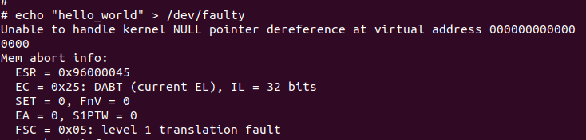

# Faulty OOPS analysis

## Command used
    $ echo "hello_world" > /dev/faulty

## Output
    # echo "hello_world" > /dev/faulty
    Unable to handle kernel NULL pointer dereference at virtual address 0000000000000000
    Mem abort info:
      ESR = 0x96000045
      EC = 0x25: DABT (current EL), IL = 32 bits
      SET = 0, FnV = 0
      EA = 0, S1PTW = 0
      FSC = 0x05: level 1 translation fault
    Data abort info:
      ISV = 0, ISS = 0x00000045
      CM = 0, WnR = 1
    user pgtable: 4k pages, 39-bit VAs, pgdp=000000004261a000
    [0000000000000000] pgd=0000000000000000, p4d=0000000000000000, pud=0000000000000000
    Internal error: Oops: 96000045 [#1] SMP
    Modules linked in: hello(O) faulty(O) scull(O)
    CPU: 0 PID: 159 Comm: sh Tainted: G           O      5.15.18 #1
    Hardware name: linux,dummy-virt (DT)
    pstate: 80000005 (Nzcv daif -PAN -UAO -TCO -DIT -SSBS BTYPE=--)
    pc : faulty_write+0x14/0x20 [faulty]
    lr : vfs_write+0xa8/0x2b0
    sp : ffffffc008d23d80
    x29: ffffffc008d23d80 x28: ffffff8002698000 x27: 0000000000000000
    x26: 0000000000000000 x25: 0000000000000000 x24: 0000000000000000
    x23: 0000000040000000 x22: 000000000000000c x21: 00000055716d2670
    x20: 00000055716d2670 x19: ffffff8002661800 x18: 0000000000000000
    x17: 0000000000000000 x16: 0000000000000000 x15: 0000000000000000
    x14: 0000000000000000 x13: 0000000000000000 x12: 0000000000000000
    x11: 0000000000000000 x10: 0000000000000000 x9 : 0000000000000000
    x8 : 0000000000000000 x7 : 0000000000000000 x6 : 0000000000000000
    x5 : 0000000000000001 x4 : ffffffc0006f7000 x3 : ffffffc008d23df0
    x2 : 000000000000000c x1 : 0000000000000000 x0 : 0000000000000000
    Call trace:
     faulty_write+0x14/0x20 [faulty]
     ksys_write+0x68/0x100
     __arm64_sys_write+0x20/0x30
     invoke_syscall+0x54/0x130
     el0_svc_common.constprop.0+0x44/0xf0
     do_el0_svc+0x40/0xa0
     el0_svc+0x20/0x60
     el0t_64_sync_handler+0xe8/0xf0
     el0t_64_sync+0x1a0/0x1a4
    Code: d2800001 d2800000 d503233f d50323bf (b900003f) 
    ---[ end trace 9f69a48cd2a74784 ]---

## Analysis
- Kernel fault occurred when kernel is trying to dereference NULL pointer at virtual address 0x00.
  
- Kernel fault happened due to Internal error Oops which ocurred 1 time on CPU 0.
- `Hardware name: linux,dummy-virt (DT)` indicates hardware running is linux OS and dummy-virt machine.
- `Modules linked in: hello(O) faulty(O) scull(O)` Modules loaded are hello, faulty and scull.
- `pc: faulty_write+0x14/0x20 [faulty]` represents fault occurred while executing instruction at offset 0x14 from `faulty_write` function of 0x20 bytes long loaded in faulty module.
- `lr : vfs_write+0xa8/0x2b0` link register is at instruction of offest 0xa8 in `vfs_write` function of 0x2b0 bytes long.
- `sp : ffffffc008d23d80` stack pointer address
- x0 - x29 register addresses are dumped
  
  
- Call trace of `faulty_write` function from `faulty` module is shown below.
  

# Objdump Analysis
## Command
    $ /output/host/aarch64-butldroot-linux-uclibc/bin/objdump -S ./output/target/lib/modules/5.15.18/extra/faulty.ko

## Output

- Above objdump shows the disassembly of `faulty_write` function. Instruction at address 0x14 `str wzr , [x1]` caused NULL pointer dereference while accessing x1 register at address 0x00.

# References
- https://www.opensourceforu.com/2011/01/understanding-a-kernel-oops/
